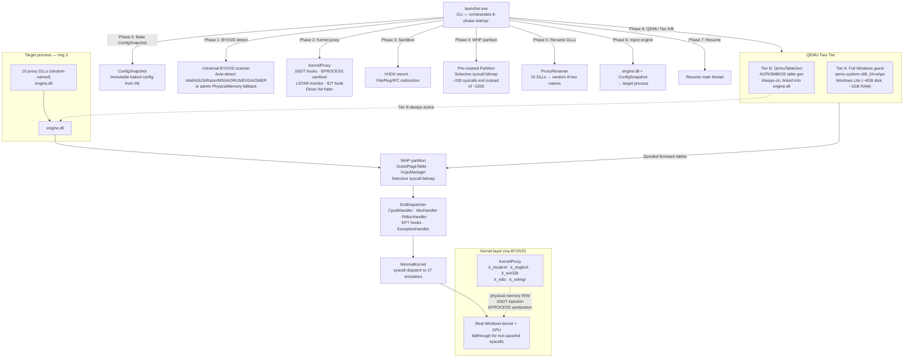

# Symbiote

**A ring-3 Windows research hypervisor for studying anti-tampering and virtualization-detection techniques.**

Symbiote drops a target process into a hardware-virtualized VCPU using Microsoft's [Windows Hypervisor Platform](https://learn.microsoft.com/en-us/virtualization/api/) (WHP) and intercepts every CPUID, MSR, RDTSC, syscall, memory access, and exception it generates. Instead of a kernel driver, it works primarily from user mode: a launcher injects an engine DLL into the target, the engine stands up a WHP partition and identity-maps the process into it, and fifteen small proxy DLLs shim the real system DLLs so most API calls still go straight to Windows — only the handful that would reveal the presence of a hypervisor get intercepted and answered from a configurable profile. An optional BYOVD (Bring Your Own Vulnerable Driver) module can be enabled for kernel-level memory access via a signed third-party driver, and an Xbox GDK proxy DLL provides identity spoofing for Microsoft Store/Xbox Game Pass titles.

It exists to answer a fairly specific question: what does a piece of commercial protection software (DRM, anti-cheat, an EDR agent, a licensing check) actually look at when it's trying to decide whether it's running on real hardware, and what does it take to make those checks come back clean? Each subsystem in this repo corresponds to one class of detection vector — CPUID hypervisor bits, RDTSC timing deltas, KUSER_SHARED_DATA fields, SMBIOS/ACPI tables, WMI queries, registry artifacts — with the interception mechanism and the spoofed response living next to each other so you can read exactly how a given vector is answered.

> **Educational and security-research use only.** This is not a tool for bypassing copy protection, violating a platform's terms of service, or cheating in online games, and it isn't licensed for that. See [License](#license).

---

## Contents

- [Architecture](#architecture)
- [Quick start](#quick-start)
- [Project layout](#project-layout)
- [Components](#components)
- [Building](#building)
- [Configuration](#configuration)
- [Sandbox profiles](#sandbox-profiles)
- [Status](#status)
- [Related work](#related-work)
- [License](#license)

---

## Architecture



`launcher.exe` creates the target suspended, injects `engine.dll`, and calls its exported `Engine_Init`. From there the engine does three things at once: it creates a WHP partition and clones the target's own memory into it via identity-mapped EPT (the same technique [WinVisor](https://github.com/ionescu007/winvisor) uses, so no separate guest image or kernel driver is needed), it installs the proxy DLLs' hooks for the syscalls and API calls that need spoofed answers, and it starts a VCPU per configured core with `SYSCALL` redirected to a page of `HLT` instructions so every syscall the target makes exits back to the engine instead of running natively.

From there, most of the work is exit handling: CPUID/RDTSC/MSR reads get intercepted at the WHP level and answered from the config profile; syscalls that need spoofing (`NtQuerySystemInformation`, registry reads under `HARDWARE\DESCRIPTION`, storage IOCTLs, etc.) get caught by `MinimalKernel`'s dispatcher and routed to one of seventeen small emulator modules; everything else falls through to the real Windows kernel unmodified. The result is a target process that's mostly running for real, with a narrow, auditable set of interception points.

Full write-up: [`docs/ARCHITECTURE.md`](docs/ARCHITECTURE.md). Per-vector breakdown of what's intercepted and how: [`docs/TECHNIQUES.md`](docs/TECHNIQUES.md). Real-hardware-vs-configured-profile comparison tables: [`docs/RESULTS.md`](docs/RESULTS.md).

### Design decisions worth knowing about

| Decision | Why |
|---|---|
| **No `0xCC` breakpoint hooks anywhere** | Syscall interception is done entirely via LSTAR→HLT redirection at the WHP level, not INT3 patching. Nothing ever writes to executable memory in the target, so a page-hash or CRC check over `.text` sees the same bytes it would on bare metal. |
| **Real system DLLs stay loaded** | The 15 proxy DLLs forward almost everything to the genuine `ntdll.dll`/`kernel32.dll`/etc.; they only intercept the specific exports that need a different answer. A module list walk still finds real Microsoft-signed DLLs at their normal load addresses. |
| **Process migration, not a fresh VM boot** | The target process is created suspended, then its own address space is identity-mapped straight into the WHP guest — no separate guest OS image, no second boot sequence to keep in sync with the host. |
| **Sandboxie-style isolation is a separate, optional layer** | Copy-on-write file/registry redirection and ALPC/pipe filtering live in their own modules (`FileRedirection`, `RegistryRedirection`, `IpcFilter`) coordinated by `SandboxFallthrough`, independent of the hypervisor-detection countermeasures. You can run with sandboxing off and hiding on, or vice versa. |
| **GPU passthrough, not GPU emulation** | `DxvkIntegration`/`GpuBridge` detect and forward to the real GPU driver (with `VK_ICD_FILENAMES` pointed at the genuine Vulkan ICD), rather than trying to virtualize the display adapter. |
| **Large-page EPT + a pre-mapped working set** | Guest memory is mapped in 2MB pages where possible and a working-set region is pre-mapped at startup, cutting the number of runtime EPT-violation exits substantially versus mapping everything on demand in 4KB pages. |
| **Runtime self-checks, not just static config** | `ConsistencyVerifier` runs eleven checks at startup and periodically afterward — MSR handshake, KUSER tick-domain consistency, APERF/MPERF ratio, cross-VCPU time sync, monotonicity, EPT map integrity — to catch a spoofed profile that's internally inconsistent (e.g. a TSC frequency that doesn't match the configured CPUID leaf 0x15/0x16) before something else notices first. |

Full vector-by-vector table (CPUID leaves, MSR ranges, registry keys, firmware tables, and which module answers each one) is in [`docs/TECHNIQUES.md`](docs/TECHNIQUES.md).

---

## Quick start

```bat
git clone https://github.com/the-lust/Symbiote
cd Symbiote
cmake --preset msvc-x64
cmake --build --preset msvc-x64
```

Binaries land in `build/msvc/x64/bin/Release`. Copy `config/config.example.ini` to `config/config.ini`, adjust it for your machine (see [Configuration](#configuration)), then run something under it:

```bat
launcher.exe --target C:\Windows\System32\notepad.exe
```

or run the built-in check suite to see what the current config actually produces:

```bat
verify.exe
```

`verify.exe` runs standalone (no injection) and prints real-vs-expected results for CPUID, RDTSC, MSR, KUSER, syscalls, PEB, registry, WMI, and network vectors — a fast way to sanity-check a profile before pointing the launcher at anything.

---

## Project layout

```
symbiote/
├── CMakeLists.txt              # 25 build targets, /W4 /WX on MSVC
├── CMakePresets.json            # 6 presets (msvc/mingw × x64/x86 × release/debug)
├── LICENSE
├── config/
│   ├── config.example.ini       # Copy to config.ini and edit — see Configuration below
│   └── capture.ini              # Capture-mode profile (logs queries, spoofs nothing)
├── profiles/                    # stealth.ini / compat.ini / analysis.ini / capture.ini
├── docs/
│   ├── ARCHITECTURE.md
│   ├── TECHNIQUES.md            # per-vector deep dive
│   ├── RESULTS.md               # real vs. configured comparison tables
│   └── RESEARCH.md
├── scripts/
│   ├── build.bat
│   └── setup-dev.ps1            # checks VS/CMake/SDK/WHP availability
├── tools/
│   ├── capture/                 # standalone fingerprint capture tool
│   ├── handshake_test/          # CPUID handshake protocol test
│   ├── virtualdisk_test/        # VHDX mount / storage IOCTL test
│   └── msr_reader/               # raw MSR reader (needs a signed driver)
└── src/
    ├── launcher/                 # launcher.exe: process creation, DLL injection
    ├── engine/                   # engine.dll — everything else
    │   ├── whp/                  # partition, VCPUs, EPT, exit handlers, hiding (35 modules)
    │   ├── backend/               # CPU-backend abstraction (WhpBackend + UnicornBackend both usage-ready)
    │   ├── kernel/                # MinimalKernel syscall dispatcher
    │   ├── emu/                  # 17 per-domain syscall emulators
    │   ├── proxy/                 # IAT/EAT patching, inline hooks, GPU bridge, ApiSet resolver
    │   ├── profile/               # GPU/storage/timing identity profiles
    │   ├── capture/               # structured TSV capture logging
    │   ├── debug/                 # GDB stub (TCP :1234)
    │   ├── replay/                # deterministic record/replay
    │   └── log/                  # trace logging
    ├── byovd/                     # BYOVD driver loader + signed third-party driver binary
    ├── proxydlls/                 # 15 proxy DLL shims (ntdll, kernel32, wbem, xgameruntime, ...)
    └── verify/                    # verify.exe check suite
```

---

## Components

| Component | Location | Role |
|---|---|---|
| `launcher.exe` | `src/launcher/` | Creates the target suspended, injects `engine.dll`, calls `Engine_Init`, sets an entry-point trampoline, handles `--profile` |
| `engine.dll` | `src/engine/` | Everything else — hypervisor, syscall emulation, proxy DLL support |
| `Partition` | `whp/Partition.*` | WHP partition lifecycle, MSR bitmap, exception bitmap, working-set pre-map, 2MB large pages, on-demand EPT paging |
| `GuestPageTable` | `whp/GuestPageTable.*` | 4-level identity-mapped guest page tables |
| `VcpuManager` | `whp/VcpuManager.*` | VCPU lifecycle, LSTAR→HLT syscall redirection, round-robin scheduling across VCPUs |
| `SyscallDispatch` / `SyscallTables` | `whp/Syscall*.*` | Runtime SSN detection cross-checked against static per-build tables, host-`ntdll` forwarding |
| `CpuidHandler` / `MsrHandler` / `RdtscHandler` | `whp/*Handler.*` | Exit handlers for their respective instructions — masking, spoofing, APERF/MPERF consistency tracking |
| `WhpHiding` | `whp/WhpHiding.*` | Hypervisor-presence countermeasures that don't fit neatly under one exit handler |
| `EptHook` / `EptExecHook` / `EptMemoryManager` / `EptSplitView` / `EptPageProtect` | `whp/Ept*.*` | EPT violation handling, execution hooks, on-demand paging, per-VCPU memory views, page-permission hooks |
| `SystemSpoofer` | `whp/SystemSpoofer.*` | EPT-based interception of SGDT/SIDT/SLDT/STR/XGETBV |
| `KuserSync` / `KuserHook` | `whp/Kuser*.*` | KUSER_SHARED_DATA consistency: live sync while WHP is active, VEH overlay as a fallback |
| `TimingCoordinator` | `whp/TimingCoordinator.*` | Cross-handler RDTSC/CPUID pattern tracking and TSC-frequency consistency, shared by `CpuidHandler` and `RdtscHandler` |
| `AcpiTimerHandler` | `whp/AcpiTimerHandler.*` | Synthetic ACPI PM timer + HPET counters |
| `KernelLock` | `whp/KernelLock.*` | Global-exclusive / per-VCPU-shared lock serializing handler state access across VCPU threads |
| `Snapshot` | `whp/Snapshot.*` | VCPU + handler state save/restore, in memory, off by default |
| `ConsistencyVerifier` | `whp/ConsistencyVerifier.*` | Eleven runtime self-checks — see [design decisions](#design-decisions-worth-knowing-about) above |
| `ExitDispatcher` / `ExceptionHandler` | `whp/*.* ` | WHP exit-reason routing; guest exception handling (#BP, #DB, #UD, #PF, #MF, #XM) |
| `VirtualDisk` | `whp/VirtualDisk.*` | VHDX/VHD create/attach/mount via the Win32 virtdisk API |
| `FileRedirection` / `RegistryRedirection` | `whp/*Redirection.*` | Copy-on-write file/registry isolation, wired into `FileEmu`/`RegistryEmu` |
| `IpcFilter` | `whp/IpcFilter.*` | Configurable ALPC/named-pipe pattern blocking |
| `SandboxFallthrough` | `whp/SandboxFallthrough.*` | Coordinates the three isolation modules above |
| `MinimalKernel` | `kernel/MinimalKernel.*` | The syscall dispatcher — routes to whichever of the 17 `emu/` modules owns a given syscall |
| `ProcessEmu` / `MemoryEmu` / `FileEmu` / `RegistryEmu` / `TimingEmu` / `CryptoEmu` | `emu/*.*` | Per-domain syscall emulation |
| `ThreadManager` / `ThreadHider` | `emu/*.*` | Thread lifecycle emulation and enumeration filtering |
| `PeLoader` | `emu/PeLoader.*` | PE parsing for process migration — import table, relocations |
| `HwIdEmu` | `emu/HwIdEmu.*` | Disk/volume serials, ATA/NVMe identify data, S.M.A.R.T, BIOS/baseboard/chassis serial |
| `MemoryGuardEmu` | `emu/MemoryGuardEmu.*` | PAGE_GUARD tracking and cross-process read/write filtering at the syscall level |
| `IatPatch` / `InlineHook` | `proxy/*.*` | IAT/EAT patching with ApiSet awareness; trampoline-based inline hooks |
| `ApiSetResolver` | `proxy/ApiSetResolver.*` | Parses the ApiSet schema from the PEB to resolve `api-ms-win-*` contract names |
| `GpuBridge` / `DxvkIntegration` | `proxy/*.*` | Real-GPU-driver passthrough, DXVK detection and Vulkan ICD forwarding |
| `ModuleCloak` | `proxy/ModuleCloak.*` | Unlinks a module from all three PEB loader lists |
| `EngineExports` | `proxy/EngineExports.*` | Sole named export (`Engine_GetExport`) + function address table — proxy DLLs resolve all engine functions by ID; table header written to shared memory at engine init |
| `WhpBackend` / `UnicornBackend` / `ICpuBackend` | `backend/*.*` | CPU-backend abstraction — `WhpBackend` wraps WHP lifecycle, `UnicornBackend` wraps Unicorn Engine (dynamically loaded `unicorn.dll`). Both implement `ICpuBackend`; selectable via `[backend] type=whp|unicorn` in config. |
| `ByovdDriver` | `byovd/ByovdDriver.*` | BYOVD driver loader: load, map physical memory, create `\Device\SymbPhysMem`, unload — kernel memory access via a signed third-party driver |
| BYOVD driver binary | `byovd/gpu_runtime_driver_rs2.sys` | Signed Intel GPU driver used for kernel-mode physical memory mapping |
| Proxy DLLs (15) | `proxydlls/*/` | Shims for `ntdll`, `kernel32`, `kernelbase`, `advapi32`, `user32`, `wbem`, `wtsapi32`, `secur32`, `crypt32`, `winhttp`, `dnsapi`, `iphlpapi`, `ws2_32`, **`xgameruntime`** |
| `verify.exe` | `src/verify/` | Standalone check suite — see [Quick start](#quick-start) |
| `capture_tool` / `handshake_test` / `virtualdisk_test` / `msr_reader` | `tools/*/` | Standalone utilities for fingerprint capture, the CPUID handshake protocol, VHDX/IOCTL testing, and raw MSR reads |

---

## Building

### Prerequisites

- Windows 10/11 x64
- Visual Studio 2022 with the "Desktop development with C++" workload (or MinGW-w64 for the `mingw-*` presets)
- CMake 3.20+
- Windows SDK with `WinHvPlatform.h`/`WinHvPlatform.lib` (included in recent SDK versions)
- Windows Hypervisor Platform enabled — `Enable-WindowsOptionalFeature -Online -FeatureName HypervisorPlatform`, then reboot

### Presets

| Preset | Arch | Config | Compiler |
|---|---|---|---|
| `msvc-x64` | x64 | Release | MSVC |
| `msvc-x64-debug` | x64 | Debug | MSVC |
| `msvc-x86` | x86 | Release | MSVC |
| `msvc-x86-debug` | x86 | Debug | MSVC |
| `mingw-x64` | x64 | Release | MinGW |
| `mingw-x86` | x86 | Release | MinGW |

```bat
cmake --preset msvc-x64
cmake --build --preset msvc-x64
```

`scripts\build.bat` wraps the same commands and accepts `debug`, `x86`, `x86-debug`, `mingw`, `mingw-x64`. All 21 targets build clean under `/W4 /WX` — no suppressed warnings.

### Developer setup

```bat
powershell -ExecutionPolicy Bypass -File scripts\setup-dev.ps1
```

Checks that Visual Studio, CMake, the Windows SDK, and WHP are all present and reports what's missing.

---

## Configuration

Everything is driven by an INI file — `config/config.ini` by default, or whatever `--profile <name>` points at. Start from the example:

```bat
copy config\config.example.ini config\config.ini
```

then edit it. `config.ini` is gitignored deliberately: it's meant to hold your own hardware profile, and real disk serials, MAC addresses, and system UUIDs shouldn't end up in git history.

A profile is organized by vector — `[cpuid]`, `[msr]`, `[kuser]`, `[hardware]`, `[storage]`, and so on — each with a `status`/`enabled` toggle and the values to serve when it's on. Two defaults worth knowing about explicitly:

```ini
[cpuid]   status = 0   ; off by default — CPUID interception has to be turned on deliberately
[rdtsc]   status = 0   ; same for RDTSC
[msr]     status = 1
[kuser]   status = 1
```

CPUID and RDTSC interception default to *off* (passthrough) in the shipped example, everything else defaults to *on*. Don't assume every vector documented in `docs/TECHNIQUES.md` is live without checking the profile you're actually running — `verify.exe` will tell you directly rather than you having to read the ini.

---

## Sandbox profiles

`profiles/` holds a few starting points, in the spirit of [RedSand](https://github.com/redcode-labs/RedSand)'s `.wsb` presets:

| Profile | File | What it's for |
|---|---|---|
| *(none)* | `config/config.ini` | Whatever you've configured locally |
| `stealth` | `profiles/stealth.ini` | Maximum hypervisor-transparency + full sandbox isolation |
| `compat` | `profiles/compat.ini` | Minimal interception — closest to running the target natively, useful for isolating whether a problem is Symbiote-induced |
| `analysis` | `profiles/analysis.ini` | GDB stub on, capture logging on, breaks at entry — for stepping through a target under the hypervisor |
| `capture` | `profiles/capture.ini` | Logs every fingerprint query without answering any of them, for building a profile from observed behavior |

```bat
launcher.exe --profile stealth --target C:\Path\to\target.exe
launcher.exe --profile capture --target C:\Windows\System32\notepad.exe
```

Copy one of these to make your own.

---

## Status

Single maintainer, actively worked on, no CI yet. This section is meant to be read before you rely on anything below — it's where the honest gaps live, not just the finished parts.

**What's been hardened:** a fairly extensive correctness pass has gone through the VCPU lifecycle, EPT paging, the PE loader used for process migration, the syscall dispatch tables, and most of the proxy DLLs — fixing a double-free on VCPU teardown, a swapped-argument bug that crashed on an extremely common syscall pattern, an out-of-bounds stack read, unbounded PE-parsing that didn't validate offsets against the target buffer, several unlocked data structures shared across VCPU threads, and a handful of dead code paths that looked wired up but weren't (a save-state feature that could never actually restore anything, a memory-scan detector that was never armed, a patch-application loop that silently stopped after the first skipped region). None of that is meant as a boast — it's a list of the kind of bugs a project like this accumulates fast, and a marker for what's already been looked at closely versus what hasn't.

**What's been recently completed:**

- **`ICpuBackend`/`WhpBackend` abstraction is now properly wired up.** `WhpBackend` has been refactored from a stub into a fully functional WHP lifecycle manager — partition creation, VCPU setup, EPT identity mapping, and syscall dispatch are all routed through it. The backend exposes a clean C-linkage interface that both the launcher and the engine call into, replacing the direct `Partition`/`VcpuManager` usage that previously lived in the engine alone. Shared state (the partition handle, VCPU array, lock, and backend config) is managed by `WhpBackend` itself, and all the original WHP modules (`Partition`, `VcpuManager`, `ExitDispatcher`, etc.) are accessible as before through the backend's exported pointers.
- **`IpcFilter` and `RegistryRedirection` are now fully wired into `ntdll_proxy`.** The proxy DLL's `dllmain.cpp` has been extended with sandbox-route entry points that call `EngineExports_ShouldBlockIpc` and `EngineExports_ShouldRedirectRegistry` before dispatching ALPC/pipe connections and registry reads. The sandbox-routing decision logic in `EngineExports` itself has also been added, completing the chain from proxy DLL → engine exports → sandbox module.
- **BYOVD (Bring Your Own Vulnerable Driver) module added.** `ByovdDriver` loads a signed third-party driver (`gpu_runtime_driver_rs2.sys`) to gain `\Device\PhysicalMemory`-style access from user mode, maps physical memory for hypervisor-level introspection, and unloads cleanly. Gated by a `[byovd]` config section — off by default.
- **Xbox GDK proxy DLL added.** `xgameruntime_proxy/dllmain.cpp` shims `xboxgameruntime.dll` / `Microsoft.Gaming.XboxGameBarRT.dll` for titles running under the Xbox Game Pass / Microsoft Store runtime. Returns spoofed identity data via the same `EngineExports` HWID infrastructure.
- **Sandbox routing entry point fully implemented.** `EngineExports.cpp/.h` now exports `EngineExports_ShouldRedirectRegistry` and `EngineExports_ShouldBlockIpc` — called by `ntdll_proxy` — and `EngineExports_GetSpoofedIdentity` — called by `xgameruntime_proxy`. The HWID data, firmware tables, and sandbox decisions all live behind these three entry points.
- **CPUID leaf 0x1A (hybrid topology) handler added.** `SystemProfile` supports `[cpuid.0x1A]` config section for hybrid profile data. `HwDetect::ApplyFeatureMask` has an explicit case for leaf 0x1A (clears EBX/EDX on subleaf 0, subleaf 1 passthrough with masking). `CpuidHandler` serves leaf 0x1A with subleaf 0 (`nativeModelId`/`coreType`) and subleaf 1 (`coreCount`/`coreMask`) — returns zero for non-hybrid CPU profiles (Xeon, AMD, all existing defaults).
- **Handler serialization for Snapshot save/restore.** `CpuidHandler`, `RdtscHandler`, and `MsrHandler` now expose `Serialize()`/`Deserialize()` methods. `Snapshot::CreateInMemory()` and `Create()` call them in order (Cpuid → Rdtsc → Msr → EptExecHook), and `Snapshot::RestoreInMemory()`/`Restore()` deserialize in the same sequence. EPT memory regions are rebuilt on restore via `Partition::MapGpaRange()`.
- **VcpuManager save/restore checkpointing.** `VcpuManager::SaveCheckpoint()` and `RestoreCheckpoint()` serialize VCPU register state (46 registers via `WHvGetVirtualProcessorRegisters`/`WHvSetVirtualProcessorRegisters`) into a flat buffer under `KernelLock`. `Partition::SetVcpuCount()` tracks VCPU count for snapshot metadata. On engine shutdown, `Main.cpp` saves `checkpoint.snap` when snapshot is enabled.
- **`UnicornBackend` fully implemented with dynamic `unicorn.dll` loading.** All `ICpuBackend` stubs are now filled: `uc_open`/`uc_close` for engine lifecycle, `uc_emu_start` for execution, `uc_reg_read`/`uc_reg_write` for register access, `uc_mem_map_ptr`/`uc_mem_unmap` for memory mapping, `uc_mem_read`/`uc_mem_write` for memory access, and a `UC_HOOK_CODE` callback that detects `0F 05` SYSCALL instructions. The backend loads `unicorn.dll` at runtime via `LoadLibraryA` (no compile-time dependency) and resolves all symbols via `GetProcAddress`. A new `[backend] type = unicorn` config option selects it; the engine creates a `g_unicornBackend` instance and cleans it up on shutdown.
- **ConfigSnapshot (immutable config baking).** `ConfigSnapshot.h` defines the entire engine configuration as a single flat struct — CPU profile, timing, BIOS/SMBIOS, storage, GPU, network, sandbox, BYOVD, kernel proxy, memory, rename table, and feature flags. Populated once by the launcher at setup from `config.ini`, then baked into the target process at injection time. The INI file can be deleted at runtime with no effect.
- **Universal BYOVD auto-detection.** `ByovdDetect` scans 8 known vulnerable signed drivers (Intel GPU, ASUS GLCKIo, Razer RzDriver, MSI WinRing0, AORUS, EVGA, GMER, PhyMem) at runtime, tries each until one works, and falls back to admin `\\.\PhysicalMemory` if none are present. Capabilities are validated by probe IOCTLs. Supports physical memory R/W, kernel memory R/W, pool allocation, memory mapping, and SSDT hooks — all via IOCTL wrapper methods.
- **KernelProxy framework with SSDT + EPROCESS + LSTAR + IDT hooks.** `KernelProxy` writes kernel-mode stubs into non-paged pool via BYOVD physical memory. Deploys an EPROCESS sanitizer thread (hides from Dbgk, spoofs CreateTime, spoofs parent PID, clears PEB flags), an LSTAR/MSR change monitor (detects and restores anti-cheat LSTAR hooks), an IDT hook for syscall pre-filtering, and a driver list hider. Five kernel stub targets (`k_ntoskrnl`, `k_dxgkrnl`, `k_win32k`, `k_ndis`, `k_volmgr`) each contain initialization and spoof entry points for SSDT injection.
- **ProxyRenamer (random 8-hex-digit DLL naming).** Each run generates unique random names for all 15 proxy DLLs from a cryptographic seed (BCryptGenRandom). Rename table is baked into `ConfigSnapshot` and passed to the engine via shared memory. Engine loads proxies by their random names — no DLL name in the target process directory reveals the proxy's purpose. FNⅤ-1a hash used for integrity verification.
- **Orchestrator (8-phase launcher startup).** `Orchestrator` runs the full 8-phase boot sequence: Phase 0 (bake `ConfigSnapshot` from INI), Phase 1 (BYOVD auto-detect), Phase 2 (kernel proxy injection), Phase 3 (sandbox/VHDX setup), Phase 4 (WHP partition pre-creation), Phase 5 (proxy DLL rename), Phase 6 (engine + snapshot injection), Phase 7 (target resume). Each phase returns success/failure with error messages. Reverse-order shutdown for clean teardown.
- **QEMU firmware table generation (Tier B).** `QemuTableGen` generates complete ACPI (RSDP, RSDT, XSDT, FADT, FACS, DSDT, HPET, MCFG, DMAR) and SMBIOS (Type 0/1/4) tables from configuration. Tables are deployed into WHP partition GPA space at engine init. Always-on — no separate QEMU process needed. Configurable via `[qemu_tier_b]` section. The firmware region is built as a contiguous blob and identity-mapped via `Partition::MapGpaRange`.
- **Selective syscall interception bitmap.** `Partition::SetupSyscallBitmap` configures WHP to VM-exit only on ~200 spoofed syscalls (NtQuerySystemInformation, NtQueryInformationProcess, NtOpenKey, etc.) instead of all ~2200. The remaining ~2000 syscalls execute natively at full speed, reducing VM-exit overhead by ~90%. Configurable via `[syscall_bitmap]` section.
- **Export Address Table replaced with function address table (sole named export).** `Engine_GetExport` is now the **only** named export from `engine.dll` — all 22 engine functions are resolved by integer ID via this single entry point. `#pragma comment(linker, "/EXPORT:RouteSyscall")` and all other per-function named exports have been removed. Proxy DLLs resolve every function via `ResolveEngineExport(FUNC_*)` using the shared `ProxyExportTable.h` helper instead of `GetProcAddress(hEngine, "FuncName")`. The table header (version + count + entries) is written to shared memory at engine init via `Engine_BuildExportTable`. `GetProcAddress` by name against engine.dll will only succeed for `Engine_GetExport` itself.
- **Windows Lite build script.** `scripts/build_minimal_win.ps1` creates a bootable VHDX with a stripped Windows installation — no Explorer, no DWM, no audio, no network stack, no Defender, no update service, no bloat. Target footprint: ~4GB disk, ~512MB-1GB RAM idle. Uses DISM for package/capability removal, offline registry tweaks, file bloat deletion, and service disabling. `scripts/create_winlite_vm.ps1` creates the corresponding isolated Hyper-V Gen-2 VM.
- **Firecracker and KasperskyHook research applied.** CPU template system and CPUID normalization patterns from Firecracker informed `SystemProfile` and `CpuidHandler` design. KasperskyHook's hypervisor detection via CPUID signatures and ExGetPreviousMode pattern matching informed kernel proxy countermeasure architecture.

**What's still genuinely incomplete:**

- **`config/config.example.ini`** was recently regenerated to match the current `ConfigParser` schema (an older version of this file used a different, incompatible key format and silently wouldn't have loaded). It should work as a starting point now, but it hasn't been validated against real captured hardware — treat the MSR block especially as a plausible placeholder rather than a verified dump.
- **A couple of the `KUSER_SHARED_DATA.ProcessorFeatures` byte layouts** (`KuserHook`/`KuserSync`) are best-effort — the writes no longer corrupt each other (they used to overlap), but getting bit-exact parity with a specific real CPU's feature byte pattern would need the layout re-derived from an actual hardware dump.
- **The engine loop still manages WHP directly via `Partition`/`VcpuManager` rather than through the `ICpuBackend` interface.** The `WhpBackend` and `UnicornBackend` classes are compiled and internally consistent, but the main execution loop hasn't been refactored to dispatch through `ICpuBackend` — so `UnicornBackend` can be used programmatically via its own API but isn't yet the primary execution engine. A `[backend] type=unicorn` config option selects it for code-level emulation alongside the existing WHP runtime.
- **CPUID leaf 0x1A (hybrid topology) returns zero for non-hybrid profiles** and configured `nativeModelId`/`coreType` for hybrid ones (i9-13900K profile). The `SystemProfile` loads hybrid data from `[cpuid.0x1A]` config section, `HwDetect::ApplyFeatureMask` handles leaf 0x1A masking, and `CpuidHandler` serves leaf 0x1A with subleaf 1 support.
- **Unified architecture is structurally complete but not yet integration-tested.** The `Orchestrator`, `ByovdDetect`, `KernelProxy`, `ProxyRenamer`, `QemuTableGen`, and `ConfigSnapshot` modules are each written and compilable — `Orchestrator.Run()` replaces the old direct inject/resume logic in `launcher/Main.cpp`, and all proxy DLLs that reference engine exports (`ntdll_proxy`, `wbem_proxy`) use `ResolveEngineExport(FUNC_*)` instead of `GetProcAddress`. QEMU Tier A (full Windows guest via WHPX) is documented and scripted (`scripts/create_winlite_vm.ps1`) but the VHDX needs to be built manually via `scripts/build_minimal_win.ps1`. Kernel proxy stubs (`k_ntoskrnl`, `k_dxgkrnl`, etc.) have shellcode placeholders — the actual injection and SSDT hook logic needs per-Windows-version syscall index maps.

---

## Related work

- **[Sogen](https://github.com/hedronium/Sogen)** — WHP+Unicorn+KVM CPU backend abstraction, LSTAR→HLT syscall interception, real system DLLs loaded in the guest, GDB stub, deterministic replay. Symbiote's overall approach follows Sogen's closely; see [Credits](#credits) for the file-level attribution.
- **[WinVisor](https://github.com/ionescu007/winvisor)** — process memory cloning directly into a WHP guest via identity-mapped EPT. `ProcessCloner` implements the same idea.
- **[Sandboxie](https://github.com/sandboxie-plus/Sandboxie)** — user-mode file/registry/IPC redirection. The isolation layer here follows the same patterns at the syscall-emulation level instead of a kernel driver.
- **[RedSand](https://github.com/redcode-labs/RedSand)** — `.wsb`-style profile presets for Windows Sandbox. Inspired the `--profile` system and `scripts/setup-dev.ps1`.
- **[negativespoofer](https://github.com/SamuelTulach/negativespoofer)** — EFI-level SMBIOS spoofing, adapted here to syscall/firmware-table interception instead.
- **[mutante](https://github.com/SamuelTulach/mutante)** — kernel-mode disk serial and S.M.A.R.T. spoofing, reimplemented at the IOCTL dispatch layer.
- **[MemoryGuard](https://github.com/SamuelTulach/MemoryGuard)** — PAGE_GUARD-based memory hiding, extended to syscall-level filtering.
- **[libkrun](https://github.com/containers/libkrun)** — TSC frequency detection and CPUID brand-string generation.
- **[DXVK](https://github.com/doitsujin/dxvk)** — the GPU passthrough layer forwards to DXVK where present.
- **[Unicorn Engine](https://github.com/unicorn-engine/unicorn)** — CPU emulation framework `UnicornBackend` is built against; see [Status](#status) for integration status.

### Credits

| Project | Author | What was adapted | Where |
|---|---|---|---|
| [Sogen](https://github.com/hedronium/Sogen) | hedronium | CPU backend abstraction, LSTAR→HLT interception, real-DLL guest approach, deterministic replay, DXVK GPU passthrough, MSR bitmap tuning | `ICpuBackend.h`, `WhpBackend.*`, `UnicornBackend.*`, `VcpuManager.*`, `ReplayLogger.*`, the 15 proxy DLLs, `Partition.*`, `DxvkIntegration.*` |
| [WinVisor](https://github.com/ionescu007/winvisor) | Alex Ionescu | Process memory cloning into a WHP guest via identity-mapped EPT | `ProcessCloner.*` |
| [Sandboxie](https://github.com/sandboxie-plus/Sandboxie) | sandboxie-plus | File/registry COW redirection, ALPC/pipe filtering, VHDX sandbox storage, WMI COM wrapping | `VirtualDisk.*`, `FileRedirection.*`, `RegistryRedirection.*`, `IpcFilter.*`, `SandboxFallthrough.*`, `ntdll_proxy/dllmain.cpp`, `wbem_proxy/dllmain.cpp` |
| [RedSand](https://github.com/redcode-labs/RedSand) | redcode-labs | `.ini` profile presets, dev-environment provisioning pattern | `profiles/*.ini`, `scripts/setup-dev.ps1` |
| [negativespoofer](https://github.com/SamuelTulach/negativespoofer) | Samuel Tulach | Firmware-level SMBIOS spoofing, adapted to syscall interception | `HwIdEmu.*`, `EngineExports.*`, `ntdll_proxy/dllmain.cpp` |
| [mutante](https://github.com/SamuelTulach/mutante) | Samuel Tulach | Disk serial / S.M.A.R.T. spoofing | `HwIdEmu.*` |
| [MemoryGuard](https://github.com/SamuelTulach/MemoryGuard) | Samuel Tulach | PAGE_GUARD memory hiding | `MemoryGuardEmu.*` |
| [libkrun](https://github.com/containers/libkrun) | containers | TSC frequency detection, CPUID brand-string generation | `TimingCoordinator.*`, `CpuidHandler.*` |
| [DXVK](https://github.com/doitsujin/dxvk) | doitsujin | DXVK DLL passthrough, Vulkan layer detection | `DxvkIntegration.*`, `GpuBridge.*` |
| [Unicorn Engine](https://github.com/unicorn-engine/unicorn) | unicorn-engine | Software CPU emulation, intended fallback backend | `UnicornBackend.*` |
| [kov.dev WHP research](https://kov.dev/) | kov | WHP performance tuning: MSR bitmap sizing, large-page mappings | `Partition.*` |
| [shimbox](https://github.com/notscimmy/shimbox) | notscimmy | BYOVD user-kernel shared-memory physical-mapping pattern, WHPX QEMU integration approach | `ByovdDriver.*`, `WhpBackend.*` |
| [Firecracker](https://github.com/firecracker-microvm/firecracker) | Amazon | CPU template system, CPUID normalization, MSR template approach, minimal device model | `CpuidHandler.*`, `SystemProfile.*`, architecture inspiration |
| [KasperskyHook](https://github.com/iilegacyyii/KasperskyHook) | iilegacyyii | Hypervisor detection via CPUID signatures, ExGetPreviousMode pattern matching, inter-hypervisor coordination | kernel proxy design, detection countermeasure patterns |

Every file that implements a technique from one of these projects has a `// Credits:` comment at the top pointing back to the source.

---

## License

Custom **Symbiote Fair Usage License**, see [LICENSE](LICENSE). Short version: use, copy, modify, and redistribute it freely for lawful purposes; don't use it to circumvent copy protection or violate a platform's terms of service; it's provided as-is with no warranty and the authors aren't liable for how it's used.
